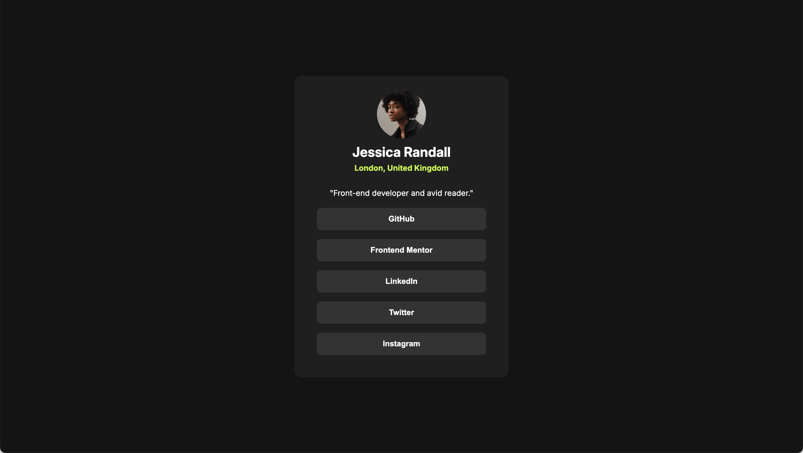

# Frontend Mentor - Social links profile solution

This is a solution to the [Social links profile challenge on Frontend Mentor](https://www.frontendmentor.io/challenges/social-links-profile-UG32l9m6dQ). Frontend Mentor challenges help you improve your coding skills by building realistic projects.

## Table of contents

- [Overview](#overview)
  - [The challenge](#the-challenge)
  - [Screenshot](#screenshot)
  - [Links](#links)
- [My process](#my-process)
  - [Built with](#built-with)
  - [What I learned](#what-i-learned)
  - [Continued development](#continued-development)
- [Author](#author)

## Overview

### The challenge

Users should be able to:

- See hover and focus states for all interactive elements on the page

### Screenshot

### Links

- Solution URL: [View Code](https://github.com/ldg/social-links-profile-main)
- Live Site URL: [View Solution](https://ldg.github.io/social-links-profile-main/)

## My process

### Built with

- Semantic HTML5 markup
- CSS custom properties
- CSS Grid
- Mobile-first workflow
- [Sass](https://sass-lang.com/) - For styles

### What I learned

I used the style guide to set up custom css properties for this project. I did this to ensure that the styles where consistent with the design files. I found this made the actual writing of the code much easier. The additional set up time made the work go much smoother.

### Continued development

A lot of what I get out of these practice projects is just getting comfortable with setting up a project and working with the development tools; setting up my Sass work flow, using the terminal, and trying to be efficient.

## Author

- Frontend Mentor - [@yourusername](https://www.frontendmentor.io/profile/ldg)
